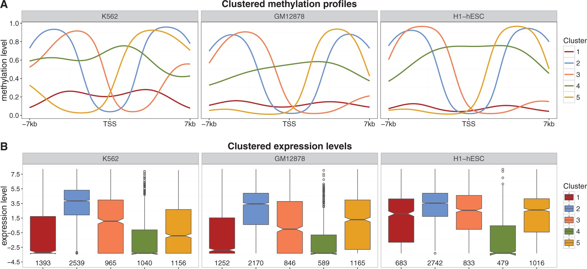
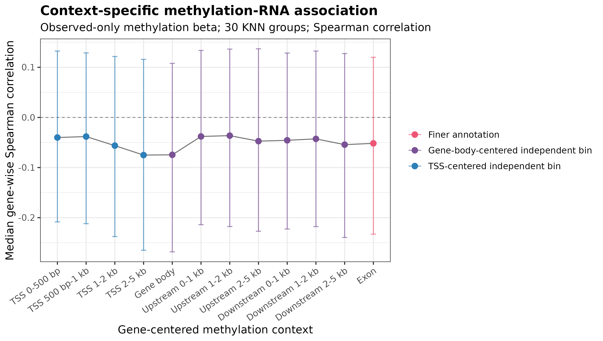
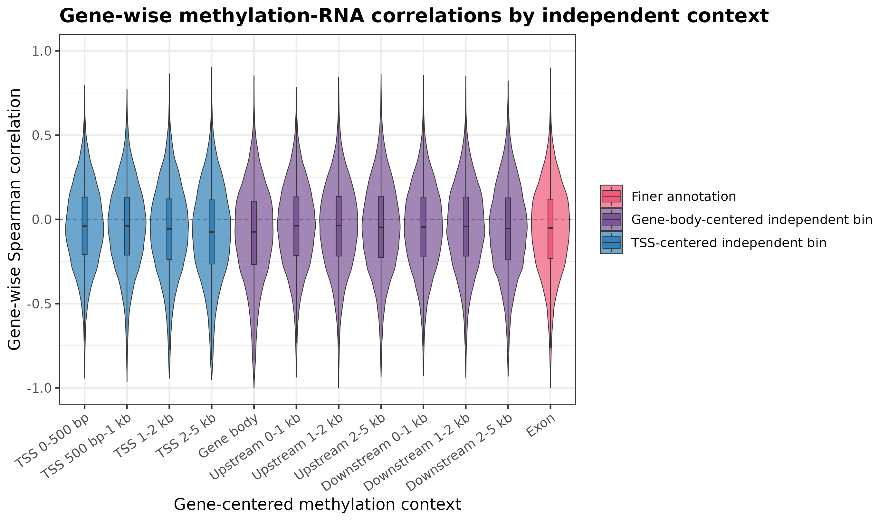
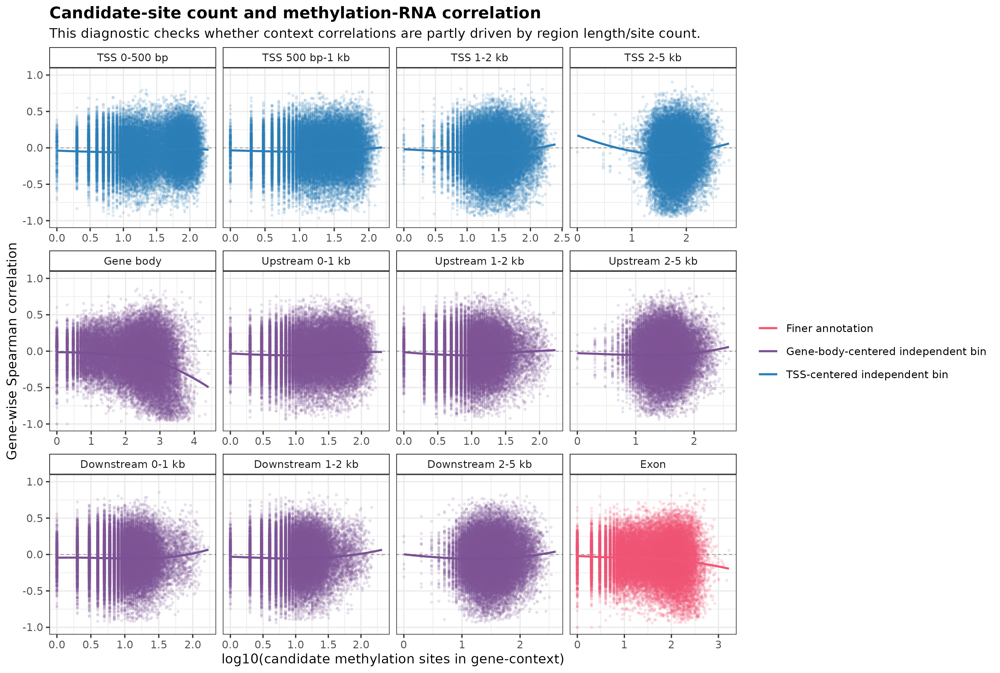
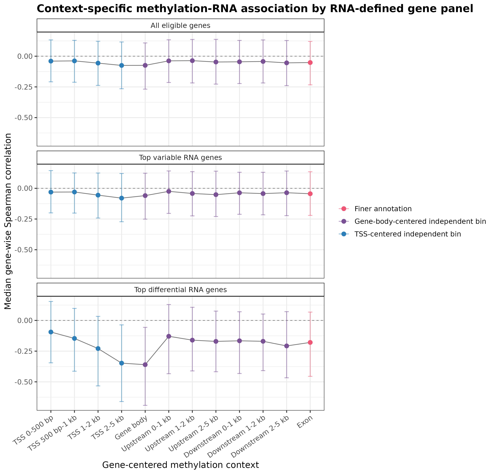
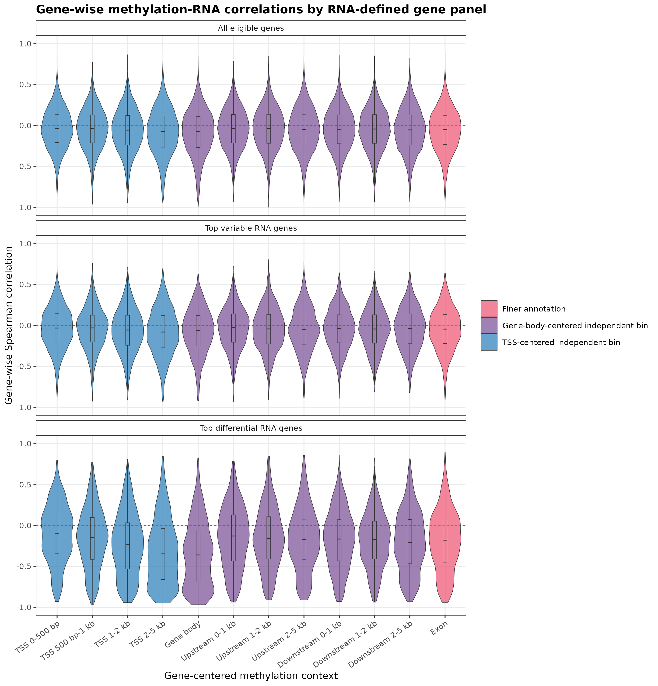

```{r}
options(bitmapType = "cairo")
library(data.table)
library(knitr)

PROJECT_ROOT <- "/home/ruh81/projects/GAS_benchmark_DNA_methylation"
eda_root <- "../results/EDA"
corr_summary <- fread(file.path(eda_root, "tables", "model_correlation_summary.csv"))
missing_beta_site_summary <- fread(file.path(eda_root, "tables", "missing_beta_site_value_summary.csv"))
missing_beta_col_defs <- fread(file.path(eda_root, "tables", "missing_beta_site_value_column_definitions.csv"))
missing_beta_global_summary <- fread(file.path(eda_root, "tables", "missing_beta_global_observed_mcg_summary.csv"))
raw_input_overview <- fread(file.path(eda_root, "tables", "raw_input_data_overview.csv"))
raw_beta_summary <- fread(file.path(eda_root, "tables", "raw_beta_matrix_summary.csv"))
raw_rna_summary <- fread(file.path(eda_root, "tables", "raw_rna_count_summary.csv"))
matched_cell_benchmark_summary <- fread(file.path(
  PROJECT_ROOT,
  "results",
  "benchmark_matched_cells",
  "model_corr_summary_matched_cells.csv"
))
context_specific_summary <- fread(file.path(
  eda_root,
  "tables",
  "context_specific_methylation_rna_summary.csv"
))
context_specific_panel_summary <- fread(file.path(
  eda_root,
  "tables",
  "context_specific_methylation_rna_summary_by_panel.csv"
))

fmt_num <- function(x) format(x, big.mark = ",", scientific = FALSE, trim = TRUE)
fmt_sig <- function(x, digits = 4) {
  ifelse(is.na(x), NA, format(signif(x, digits), big.mark = ",", scientific = FALSE, trim = TRUE))
}

```

# Synopsis

This logbook documents the progression of my analysis from benchmarking ATAC-derived gene-score models on DNA methylation data toward understanding the intrinsic relationship between DNA methylation and RNA expression.

The initial goal was to test whether the ArchR-style ATAC gene-score model family could be transferred to single-cell DNA methylation data. 

However, the benchmark results did not identify a clearly superior model comparable to the ATAC model 42 result. 

Therefore, the focus of this analysis should not be limited to benchmarking an ATAC-derived model family on DNA methylation data. Instead, the key question is how to use the structure of DNA methylation data itself to understand the relationship between methylation sites and RNA expression, and how to design a more appropriate methylation-derived gene score from that relationship.

# Central Questions
1. How should missing methylation site-cell values be handled? 

We have observed that treating all missing sites as beta = 1 across all genomic regions may not be a reasonable strategy. This assumption may be more appropriate for broadly methylated gene-body regions than for promoter-proximal regions, where observed methylation levels can be lower or more variable.

2. The ATAC-derived model family is essentially a collection of genomic spatial weighting assumptions. Applying this model family to DNA methylation implicitly assumes that methylation sites follow an ATAC-like position-dependent correlation pattern with RNA expression. This assumption has not been directly validated. Therefore, the key research question is reframed as:

**What is the intrinsic genomic-context-dependent relationship between DNA methylation and RNA expression, and how should sparse methylation observations be aggregated into gene-level scores?**

# Conceptual Background: Origin of Gene Activity Scoring

Gene activity scoring is a general strategy for converting locus-level epigenomic signals into gene-level quantities that can be compared with RNA expression. This problem arises because epigenomic assays such as scATAC-seq and single-cell DNA methylation measure regulatory information at genomic positions, peaks, tiles, or CpG sites, whereas transcriptomic readouts are usually summarized at the gene level. Therefore, integration with RNA expression requires a site-to-gene aggregation rule.

I use several gene activity models from scATAC-seq as examples of how locus-level epigenomic signals are aggregated into gene-level scores.

In [Signac](https://stuartlab.org/signac/reference/geneactivity), the `GeneActivity()` function creates a gene activity matrix by counting fragments per cell within gene bodies and promoter-proximal regions. By default, the upstream extension is 2,000 bp.

```{r, eval=FALSE, echo=TRUE}
GeneActivity(
  object,
  assay = NULL,
  features = NULL,
  extend.upstream = 2000,
  extend.downstream = 0,
  biotypes = "protein_coding",
  max.width = 5e+05,
  process_n = 2000,
  gene.id = FALSE,
  verbose = TRUE
)
```

In [Cicero](https://bioconductor.org/packages//release/bioc/vignettes/cicero/inst/doc/website.html#cicero-gene-activity-scores), promoter accessibility alone is considered insufficient for predicting gene expression. Cicero therefore uses co-accessibility links to include promoter-associated distal sites when constructing gene activity scores.

```{r, eval=FALSE, echo=TRUE}
#### Add a column for the pData table indicating the gene if a peak is a promoter ####
# Create a gene annotation set that only marks the transcription start sites of 
# the genes. We use this as a proxy for promoters.
# To do this we need the first exon of each transcript
pos <- subset(gene_annotation_sample, strand == "+")
pos <- pos[order(pos$start),] 
pos <- pos[!duplicated(pos$transcript),] # remove all but the first exons per transcript
pos$end <- pos$start + 1 # make a 1 base pair marker of the TSS

neg <- subset(gene_annotation_sample, strand == "-")
neg <- neg[order(neg$start, decreasing = TRUE),] 
neg <- neg[!duplicated(neg$transcript),] # remove all but the first exons per transcript
neg$start <- neg$end - 1

gene_annotation_sub <- rbind(pos, neg)

# Make a subset of the TSS annotation columns containing just the coordinates 
# and the gene name
gene_annotation_sub <- gene_annotation_sub[,c(1:3, 8)]

# Rename the gene symbol column to "gene"
# input_cds is peaks × cells accessibility matrix
names(gene_annotation_sub)[4] <- "gene"

input_cds <- annotate_cds_by_site(input_cds, gene_annotation_sub)

head(fData(input_cds))


#### Generate gene activity scores ####
# generate unnormalized gene activity matrix
unnorm_ga <- build_gene_activity_matrix(input_cds, conns)

# remove any rows/columns with all zeroes
unnorm_ga <- unnorm_ga[!Matrix::rowSums(unnorm_ga) == 0, !Matrix::colSums(unnorm_ga) == 0]

# make a list of num_genes_expressed
num_genes <- pData(input_cds)$num_genes_expressed
names(num_genes) <- row.names(pData(input_cds))

# normalize
cicero_gene_activities <- normalize_gene_activities(unnorm_ga, num_genes)

# if you had two datasets to normalize, you would pass both:
# num_genes should then include all cells from both sets
unnorm_ga2 <- unnorm_ga
cicero_gene_activities <- normalize_gene_activities(list(unnorm_ga, unnorm_ga2), num_genes)
```


In [MAESTRO](https://liulab-dfci.github.io/MAESTRO/example/Gene_activity_modelling/Gene_activity_modelling.html), the model assumes that the contribution of each scATAC-seq peak to gene expression is independent and additive, and that this contribution decays exponentially with the distance between the peak and the TSS.

MAESTRO includes both a simple regulatory potential model and an enhanced regulatory potential model.

The simple RP model is the basic regulatory potential model in MAESTRO. For each gene, it collects scATAC-seq peaks around the TSS. Each peak is assumed to have a potential regulatory contribution to the gene: peaks closer to the TSS receive larger weights, whereas more distant peaks are down-weighted by exponential decay.

$$
S_g = \sum_{i=1}^{k} 2^{-d_i / d_0}
$$

where:

- $S_g$: the regulatory potential score of gene $g$;
- $k$: the number of scATAC-seq peaks considered around gene $g$;
- $d_i$: the distance from the $i$-th peak to the TSS of the gene;
- $d_0$: the half-decay distance, meaning the distance at which the peak weight decreases to one half of its original value.


The enhanced model gives higher weight to peaks in exon regions and excludes peaks located in promoters or exons of nearby genes.

For ordinary regulatory peaks, the enhanced RP model still uses a TSS-distance decay similar to the simple RP model:

$$
w_{p,g} = 2^{-d_{p,g} / d_0}
$$

Thus, peaks closer to the TSS receive larger weights, while peaks farther from the TSS receive smaller weights.

The distinctive feature of the enhanced RP model is that peaks located within the exon regions of the target gene are treated as if they were located at the TSS. In other words, if a peak falls within the exonic region of the target gene, it is not down-weighted according to its actual genomic distance. Instead, it receives a higher contribution, and the exon-associated contribution is then normalized by the total exon length.

```{r, eval=FALSE, echo=TRUE}
> pbmc.peak <- Read10X_h5("10X_PBMC_10k/outs/filtered_peak_bc_matrix.h5")
> pbmc.peak[1:5,1:5]
5 x 5 sparse Matrix of class "dgCMatrix"
                   AAACGAAAGAGCGAAA-1 AAACGAAAGAGTTTGA-1 AAACGAAAGCGAGCTA-1
chr1:181285-181658                  .                  .                  .
chr1:629732-630163                  .                  .                  .
chr1:633799-634257                  .                  .                  .
chr1:778153-779430                  .                  .                  2
chr1:817056-817646                  .                  .                  .
                   AAACGAAAGGCTTCGC-1 AAACGAAAGTGCTGAG-1
chr1:181285-181658                  1                  .
chr1:629732-630163                  .                  .
chr1:633799-634257                  .                  .
chr1:778153-779430                  8                  .
chr1:817056-817646                  .                  .
> pbmc.gene <- ATACCalculateGenescore(pbmc.peak, organism = "GRCh38", decaydistance = 10000, model = "Enhanced")
> pbmc.gene[1:5,1:5]
5 x 5 sparse Matrix of class "dgCMatrix"
         AAACGAAAGAGCGAAA-1 AAACGAAAGAGTTTGA-1 AAACGAAAGCGAGCTA-1
A1BG                      .                  .        0.143831343
A1BG-AS1                  .                  .        0.096558696
A1CF                      .                  .        .
A2M                       .                  .        0.009911025
A2ML1                     .                  .        .
         AAACGAAAGGCTTCGC-1 AAACGAAAGTGCTGAG-1
A1BG             9.57918417                  .
A1BG-AS1        16.01500693                  .
A1CF             .                           .
A2M              0.01940073                  .
A2ML1            0.03820837 
```

For DNA methylation data, the relationship between DNA methylation and RNA expression is more context-dependent and is more strongly influenced by the spatial distribution of CpG sites.

Kapourani and Sanguinetti 2016 explicitly criticized the traditional strategy of using average methylation across a region. They argued that simply averaging methylation values within a genomic region often fails to explain gene expression well. Instead, they proposed using higher-order features of methylation profiles, such as profile shape and spatial correlation, to predict gene expression.



This figure from Kapourani and Sanguinetti 2016 shows clustered promoter-proximal methylation profiles across three ENCODE cell lines. The upper panel summarizes five recurrent spatial methylation profile shapes around the TSS, while the lower panel shows the corresponding expression distributions for genes assigned to each profile cluster. The key point is that genes with different methylation profile shapes can have different expression distributions, even when the profiles are defined over the same promoter-centered genomic window.

This provides an important motivation for the present methylation-RNA analysis. For DNA methylation data, it may be insufficient to aggregate methylation sites into a gene-level score using only the average methylation level or the total signal within a region. In addition to the overall methylation level, the spatial organization of CpG methylation across promoter, gene-body, and flanking contexts may also influence how methylation relates to RNA expression.

# Loading and Processing the Raw Data

This section summarizes the raw data objects used.

```{r}
raw_input_overview_display <- copy(raw_input_overview)
raw_input_overview_display[, rows := fmt_num(rows)]
raw_input_overview_display[, columns := fmt_num(columns)]
raw_input_overview_display[, nonzero_values := fmt_num(nonzero_values)]
raw_input_overview_display[, nonzero_fraction := fmt_sig(nonzero_fraction)]

kable(
  raw_input_overview_display,
  caption = "Raw methylation and RNA matrices used for methylation-RNA EDA"
)
```

For the DNA methylation beta matrices, each row represents one methylation-profiled cell, and each column represents one genomic cytosine position.

Because the beta matrices are stored separately by chromosome, the column number reported here is the total number of cytosine-position columns summed across autosomes `chr1`--`chr22`. The `nonzero_values` column counts stored non-zero beta entries in these sparse matrices.

For the RNA raw count matrix, each row represents one RNA-profiled cell, and each column represents one gene.


## Defining Gene-Centered Methylation Contexts

For the DNA methylation data, I did not define genome-wide fixed tiles, such as 500 bp or 1 kb tiles commonly used in ATAC analyses. Single-cell methylation site coverage is sparse, so fixed tiles would produce many empty bins. In addition, the mapping from tiles to genes would still need to be defined afterward.

Instead, I divided the DNA methylation data into gene-centered context bins.

These feature regions were defined from gene annotation.

For the methylation-RNA correlation analysis, methylation sites were assigned to non-overlapping independent bins. The methylation signal in each bin was then compared with the RNA expression of the same gene.

TSS-centered independent bins:

- TSS 0--500 bp
- TSS 500 bp--1 kb
- TSS 1--2 kb
- TSS 2--5 kb

Gene-body-centered independent bins:

- Gene body core
- Gene body upstream 0--1 kb
- Gene body upstream 1--2 kb
- Gene body upstream 2--5 kb
- Gene body downstream 0--1 kb
- Gene body downstream 1--2 kb
- Gene body downstream 2--5 kb

Optional finer context:
gene_body_exon

The goal is to estimate the association strength between each independent context and RNA expression, and to characterize the empirical methylation-RNA pattern. Therefore, missing sites were not imputed in this analysis. The methylation summary for each context was computed from observed-only beta values.

I used the gene annotation file generated in the main workflow, which includes gene boundaries for each gene.

```{r, eval=FALSE, echo=TRUE}
gene_anno_path <- file.path(
  paths$methylation$processed,
  "reference",
  "gencode_v28lift37_gene_df_chr1_22_with_boundaries.rds"
)

genes <- as.data.table(readRDS(gene_anno_path))
genes <- genes[chr %in% paste0("chr", 1:22)]
genes <- genes[!duplicated(gene_id)]
```

Define TSS-centered independent bins:

```{r, eval=FALSE, echo=TRUE}
bins <- data.table(
  context = c(
    "TSS_bin_0_500bp",
    "TSS_bin_500bp_1kb",
    "TSS_bin_1kb_2kb",
    "TSS_bin_2kb_5kb"
  ),
  inner_bp = c(0L, 500L, 1000L, 2000L),
  outer_bp = c(500L, 1000L, 2000L, 5000L)
)

# The innermost TSS bin is a continuous region centered on the TSS.
start <- genes$tss - outer
end <- genes$tss + outer

# Outer TSS bins are rings. They are stored as two intervals per gene:
# one upstream arm and one downstream arm.
upstream_start <- ifelse(genes$strand == "+", genes$tss - outer, genes$tss + inner + 1L)
upstream_end <- ifelse(genes$strand == "+", genes$tss - inner - 1L, genes$tss + outer)

downstream_start <- ifelse(genes$strand == "+", genes$tss + inner + 1L, genes$tss - outer)
downstream_end <- ifelse(genes$strand == "+", genes$tss + outer, genes$tss - inner - 1L)
```

Define gene-body-centered independent bins:
```{r, eval=FALSE, echo=TRUE}
body_core <- make_context_dt(
  genes = genes,
  context_name = "GeneBody_core",
  start = genes$start,
  end = genes$end,
  interval_type = "independent_bin",
  context_part = "gene_body"
)

bins <- data.table(
  context = c(
    "GeneBody_upstream_0_1kb",
    "GeneBody_upstream_1_2kb",
    "GeneBody_upstream_2_5kb",
    "GeneBody_downstream_0_1kb",
    "GeneBody_downstream_1_2kb",
    "GeneBody_downstream_2_5kb"
  ),
  side = c("upstream", "upstream", "upstream", "downstream", "downstream", "downstream"),
  inner_bp = c(0L, 1000L, 2000L, 0L, 1000L, 2000L),
  outer_bp = c(1000L, 2000L, 5000L, 1000L, 2000L, 5000L)
)

# Upstream and downstream are defined relative to gene strand.
if (side == "upstream") {
  start <- ifelse(genes$strand == "+", genes$start - outer, genes$end + inner + 1L)
  end <- ifelse(genes$strand == "+", genes$start - inner - 1L, genes$end + outer)
} else {
  start <- ifelse(genes$strand == "+", genes$end + inner + 1L, genes$start - outer)
  end <- ifelse(genes$strand == "+", genes$end + outer, genes$start - inner - 1L)
}
```

```{r, eval=FALSE, echo=TRUE}
exon_gr <- rtracklayer::import(gtf_path, format = "gtf", feature.type = "exon")
exon_gr <- exon_gr[as.character(seqnames(exon_gr)) %in% paste0("chr", 1:22)]

sanitize_gene_id <- function(x) sub("^(ENSG[0-9]+).*$", "\\1", as.character(x))
mcols(exon_gr)$gene_id <- sanitize_gene_id(mcols(exon_gr)$gene_id)

# Keep only genes present in our gene annotation.
exon_gr <- exon_gr[mcols(exon_gr)$gene_id %in% genes$gene_id]

# Merge overlapping or adjacent exon intervals within each gene into non-overlapping intervals.
exon_by_gene <- split(exon_gr, mcols(exon_gr)$gene_id)
exon_reduced <- reduce(exon_by_gene, ignore.strand = TRUE)
```

Combine the three context annotation layers:

```{r, eval=FALSE, echo=TRUE}
context_dt <- rbindlist(
  list(tss_contexts, gene_body_contexts, exon_context),
  use.names = TRUE,
  fill = TRUE
)

context_dt[, context_region_id := sprintf("ctx_%08d", .I)]

saveRDS(context_gr, rds_path)
fwrite(context_dt, csv_path)
```


# Exploratory Analysis

The key question is why ATAC can produce a model with a reproducible advantage, whereas DNA methylation does not show a similarly universal best model.

The model family is essentially a set of spatial weighting assumptions. Each model assigns different weights to genomic positions around a gene, aggregates the assay signal into a gene-level score, and then tests whether that score reproduces RNA expression. If an assay contains a stable spatial rule around genes, one weighting formula may repeatedly outperform the others.

Therefore, the immediate goal is to characterize the empirical methylation-RNA correlation pattern directly from the data, rather than assuming that DNA methylation follows the same spatial rule as ATAC accessibility.

## Research Question 1

How should missing methylation site-cell values be handled?

The current `impute1_within_feature` strategy is motivated by the observation that the mCG background is often highly methylated. However, this assumption is likely to be region-dependent. In gene bodies or broadly methylated regions, treating missing sites as beta $=1$ may be closer to a background methylation assumption. In promoter-proximal regions, however, observed beta $=0$ or low-beta sites may be more common, so forcing missing sites to beta $=1$ could artificially inflate promoter methylation scores.


## Research Question 2

What is the relationship between DNA methylation sites and RNA expression across different genomic contexts?

## Context-Specific Methylation-RNA Correlation Pattern

I next estimated methylation-RNA association directly from the site-level beta matrices. For each gene-context pair, methylation sites were first assigned to one independent context. Within each context, observed methylation beta values were averaged across 30 matched KNN groups. Missing site-cell values were ignored rather than imputed as beta $=1$, so this analysis reflects the observed methylation signal itself.

For each gene $g$ and methylation context $r$, I then correlated the context-specific methylation signal with the same-gene RNA expression across groups:

$$
\rho_{g,r}
=
cor\left(M_{g,r,\cdot}, Y_{g,\cdot}\right)
$$

Here, $M_{g,r,\cdot}$ is the observed-only methylation signal for gene $g$ in context $r$, and $Y_{g,\cdot}$ is the RNA expression of the same gene. RNA expression is not divided into genomic bins; it remains the gene-level target.

```{r}
context_specific_display <- copy(context_specific_summary)
context_specific_display[, median_spearman := round(median_spearman, 4)]
context_specific_display[, q25_spearman := round(q25_spearman, 4)]
context_specific_display[, q75_spearman := round(q75_spearman, 4)]
context_specific_display[, fraction_negative := round(fraction_negative, 3)]
context_specific_display[, median_candidate_sites := fmt_num(median_candidate_sites)]
context_specific_display[, median_observed_fraction := round(median_observed_fraction, 4)]
context_specific_display <- context_specific_display[, .(
  context = context_pretty,
  n_genes,
  median_spearman,
  q25_spearman,
  q75_spearman,
  fraction_negative,
  median_candidate_sites,
  median_observed_fraction
)]

kable(
  context_specific_display,
  caption = "Context-specific observed-only methylation-RNA Spearman correlation summary"
)
```



Across all independent contexts, the median methylation-RNA Spearman correlation is negative but weak. The strongest negative median correlations occur in `TSS 2-5 kb` and `Gene body`, both around -0.075. TSS-proximal bins closer to the TSS are also shifted negative, but less strongly. This suggests that the methylation-RNA relationship is not restricted to the immediate promoter core and may involve broader gene-proximal and gene-body signals.



The full gene-wise distributions show substantial heterogeneity. Although each context has a negative median, many genes still show positive correlations. Therefore, a single global methylation weight rule is unlikely to capture all genes equally well. This supports the idea that methylation-derived gene scoring should be context-aware rather than directly transferred from ATAC accessibility models.



Because region length and candidate-site count can affect correlation stability, I also checked whether the observed context patterns were dominated by the number of candidate methylation sites. The median observed fraction is similar across contexts, around 5.6--6.0%, but candidate-site counts differ substantially, especially for gene body. Therefore, the current result should be interpreted as a context-specific association pattern, not yet as an independent causal contribution. A stricter next step would be site-count matched subsampling or regression controlling for candidate-site count, observed fraction, gene length, and RNA expression level.

Because Luo et al. reported that a large fraction of genes did not show methylation-RNA coupling distinguishable from noise, I also repeated the context summary within RNA-defined gene panels. These panels were defined from RNA expression only, rather than from methylation-RNA correlation, to avoid selecting genes based on the same association being tested.

The three panels are:

- all eligible genes;
- top variable RNA genes;
- top differential / marker RNA genes.

```{r}
context_panel_display <- copy(context_specific_panel_summary)
context_panel_display[, median_spearman := round(median_spearman, 4)]
context_panel_display[, fraction_negative := round(fraction_negative, 3)]
context_panel_display[, median_candidate_sites := fmt_num(median_candidate_sites)]
context_panel_display[, median_observed_fraction := round(median_observed_fraction, 4)]
context_panel_display <- context_panel_display[
  ,
  .(
    panel = panel_label,
    context = context_pretty,
    n_genes,
    median_spearman,
    fraction_negative,
    median_candidate_sites,
    median_observed_fraction
  )
]

kable(
  context_panel_display,
  caption = "Context-specific methylation-RNA correlations stratified by RNA-defined gene panels"
)
```



The strongest negative correlations are concentrated in the top differential RNA genes. In this panel, the gene body and TSS 2--5 kb contexts show much stronger negative median correlations than in the all-gene background. This suggests that methylation-RNA coupling is enriched among genes that define RNA cell-state or cell-type differences.



Top variable RNA genes show only a modest strengthening compared with all eligible genes, whereas top differential genes show a much clearer negative shift. This supports using RNA-defined marker genes as a sensitive panel for discovering methylation-RNA context patterns, while keeping all eligible genes as the necessary baseline.


# Initial Benchmark Framework: ATAC-Derived Model Family

## Model Family

The methylation model family contains 57 models adapted from the ArchR gene-score framework. I grouped them into two major genomic contexts: promoter/TSS-centered models and gene-body-centered models. Within each context, models differ by window definition, distance-decay function, and whether neighboring-gene boundaries are used.

```{r}
model_family_table <- data.frame(
  major_context = c(
    "Promoter / TSS", "Promoter / TSS", "Promoter / TSS",
    "Promoter / TSS", "Promoter / TSS",
    "Gene body", "Gene body", "Gene body", "Gene body"
  ),
  subfamily = c(
    "Fixed promoter window",
    "TSS exponential, no boundary",
    "TSS exponential, boundary",
    "TSS constant, boundary",
    "TSS extended exponential, boundary",
    "Fixed gene-body window",
    "Gene-body exponential, no boundary",
    "Gene-body exponential, boundary",
    "Gene-body extended exponential, boundary"
  ),
  model_ids = c("1-6", "16-19", "20-23", "50-53", "54-57", "7-15", "24-27", "46-49", "28-45"),
  n_models = c(6, 4, 4, 4, 4, 9, 4, 4, 18),
  key_design = c(
    "TSS-centered fixed windows",
    "Decay from TSS",
    "Decay from TSS + boundary",
    "Constant weights + boundary",
    "Extended TSS core + decay",
    "Gene body with fixed extension",
    "Decay from gene body",
    "Decay + boundary",
    "Extended core + decay + boundary"
  )
)

kable(model_family_table, caption = "Summary of the 57 methylation gene-score models")
```

All models were stored as .rds objects. Key parameters were later loaded and extracted for downstream analyses. Using the GeneBodyExponentialGeneBoundary model as an example, the extracted model parameters are shown below.

```{r, echo=TRUE}
model_path <- file.path(
  PROJECT_ROOT,
  "models",
  "Models_meth",
  "Meth-GeneBodyExponentialGeneBoundary-1.rds"
)

model <- readRDS(model_path)
str(model)
```

## Formula of Aggregation

The next step is to aggregate position-level methylation signals into gene-level score blocks. For each gene $g$ and cell $c$, the model first defines a genomic feature set $\mathcal{F}(g)$, such as a promoter window or a gene-body-centered region. Each methylation site $f$ is then assigned a model-specific weight $w_{g,f}$.

The generic weighted score is:

$$
G_{g,c}=\sum_{f\in \mathcal{F}(g)} w_{g,f}\cdot x_{f,c}
$$

Here, $x_{f,c}$ is the site-level methylation beta value for site $f$ in cell $c$, and $w_{g,f}$ encodes the model assumption about how strongly site $f$ contributes to gene $g$. For fixed-window models, all included sites receive constant weight. For exponential models, sites farther from the core region receive lower weight:

$$
w(x) = \exp\!\left(-\frac{|x|}{d}\right) + \exp(-1)
$$

where $x$ is the distance from the site to the model-defined core region, and $d$ is the decay scale. The final score also depends on the missing-site rule: in the current main model family, unobserved sites within a feature are treated as beta $=1$.

## Treating Missing Sites Within A Feature As Beta = 1
I remain uncertain about how missing methylation sites should be handled.

There are two possible strategies. One is to drop missing sites and compute the feature score only from observed methylation sites. However, this can make the score highly dependent on a small number of observed sites, especially in sparse single-cell methylation data. The other strategy is to treat missing sites as beta = 1, which is the strategy currently used in our main scoring workflow.

I first summarized all observed mCG site-cell values in the representative chromosome-level beta matrices. In the sparse beta matrices, observed beta $=0$ values are not stored in the beta matrix but are recovered using the corresponding coverage matrix.

```{r}
missing_beta_global_display <- copy(missing_beta_global_summary)
missing_beta_global_display[, observed_site_cell_values := fmt_num(observed_site_cell_values)]
missing_beta_global_display[, beta_0_fraction := round(beta_0_fraction, 3)]
missing_beta_global_display[, intermediate_fraction := round(intermediate_fraction, 4)]
missing_beta_global_display[, beta_1_fraction := round(beta_1_fraction, 3)]
missing_beta_global_display[, observed_beta_mean := round(observed_beta_mean, 3)]
missing_beta_global_display <- missing_beta_global_display[, .(
  chromosome,
  observed_site_cell_values,
  beta_0_fraction,
  intermediate_fraction,
  beta_1_fraction,
  observed_beta_mean
)]

kable(
  missing_beta_global_display,
  caption = "Global observed mCG beta composition in representative chromosome-level beta matrices"
)
```

This table supports that observed mCG site-cell values in these representative chromosomes are often highly methylated, with a pooled beta $=1$ fraction above 0.8. The concern, however, is that the impact of imputing missing sites as beta $=1$ may still differ across genomic regions.

Therefore, in this section, I examined the observed mCG sites within three representative model-defined feature regions. Specifically, I quantified the proportions of observed sites with beta = 1 and beta = 0, in order to evaluate whether the observed methylation patterns support the assumption that missing sites can reasonably be treated as beta = 1.

I used three representative feature regions: `Promoter_2kb`, `Promoter_5kb`, and `GeneBody_0_0`. The analysis was restricted to representative chromosomes `chr1`, `chr7`, and `chr22`.

If the observed sites inside a feature are already close to beta $=1$, the assumption may be reasonable. If the observed sites are frequently low, imputing missing sites as beta $=1$ can artificially inflate the feature-level methylation score.

For each model and chromosome, up to 100 matched-gene features were sampled. Within each sampled feature, methylation site-cell values were sampled from candidate methylation sites and matched methylation cells, and the observed beta values were summarized.


```{r}
kable(
  missing_beta_col_defs,
  caption = "Column definitions for the missing-beta site-cell summary"
)
```

```{r}
missing_beta_site_display <- copy(missing_beta_site_summary)
missing_beta_site_display[, candidate_matched_features := fmt_num(candidate_matched_features)]
missing_beta_site_display[, sampled_features := fmt_num(sampled_features)]
missing_beta_site_display[, sampled_genes := fmt_num(sampled_genes)]
missing_beta_site_display[, site_cell_values := fmt_num(site_cell_values)]
missing_beta_site_display[, na_fraction := round(na_fraction, 3)]
missing_beta_site_display[, `beta=0` := round(`beta=0`, 3)]
missing_beta_site_display[, `beta=1` := round(`beta=1`, 3)]
missing_beta_site_display[, measured_beta_mean := round(measured_beta_mean, 3)]

kable(
  missing_beta_site_display,
  caption = "Missing beta imputation EDA summary based on sampled feature-level site-cell values"
)
```


The key difference lies in the distribution of measured beta values.

`GeneBody_0_0` has a high measured mean beta and most measured non-NA values are beta $=1$.

`Promoter_5kb` also leans toward high beta values, although less strongly than gene body.

In contrast, `Promoter_2kb` has a much lower measured beta mean and a larger fraction of measured beta $=0$ values.


This representation makes the central contrast clearer: `Promoter_2kb` contains many more measured beta $=0$ values, whereas `GeneBody_0_0` is dominated by measured beta $=1$ values.


The CDF provides the same conclusion from a cumulative perspective.

What I am truly concerned about is that imputing missing sites as beta = 1 may have different effects across genomic regions.

## Methylation-RNA Signed Correlation

Unlike ATAC accessibility, which is generally expected to show a positive relationship with gene expression, DNA methylation may show either positive or negative associations depending on genomic context. Therefore, I next examined the sign and magnitude of the matched single-cell methylation--RNA correlation using promoter methylation scores and Luo-provided gene-body mCH/mCG aggregates.

Here, I simply aim to examine the overall pattern of correlations across all genes. For each gene and each feature set, I calculated the Spearman correlation across matched cells:

$$
\rho_g =
\operatorname{cor}_{\mathrm{Spearman}}
\left(
\mathrm{RNA}_{g,\cdot},
\mathrm{Meth}_{g,\cdot}
\right)
$$

Here, $\mathrm{RNA}_{g,\cdot}$ is the expression vector of gene $g$ across matched cells, and $\mathrm{Meth}_{g,\cdot}$ is the corresponding gene-level methylation score. A shuffled control was generated by permuting methylation cell labels before computing the same correlation. This preserves the marginal distribution of each gene but removes the matched-cell pairing between methylation and RNA.


```{r}
kable(
  corr_summary[, .(
    model_label,
    n_genes,
    n_negative,
    n_positive,
    median_observed_rho = round(median_observed_rho, 4),
    median_shuffled_rho = round(median_shuffled_rho, 4),
    median_n_complete
  )],
  caption = "Signed gene-wise methylation-RNA correlation summary"
)
```

Across promoter and gene-body methylation features, the observed correlations are shifted slightly toward negative values relative to the shuffled control. However, the median correlations remain close to zero. This suggests two points: first, methylation and RNA expression are more often negatively than positively associated in this dataset; second, the matched single-cell association is generally weak for most genes.

## Aligning RNA Expression and Methylation Score Matrices

We first aggregate cells into local cell groups.

Each group contains 100 transcriptionally similar cells, defined in RNA PCA space.

The first step is to identify the cells shared by the RNA count matrix and the methylation score matrices.

The RNA matrix contains 4,358 cells, while the methylation score matrices contain 4,314 cells. In practice, the matched set corresponds to all 4,314 methylation cells.

```{r, eval=FALSE, echo=TRUE}
first_block <- manifest$out_file[[1]]
M0 <- readRDS(first_block)
meth_cells <- unique(extract_meth_cell(rownames(M0)))

rna_counts_cells_genes <- read_rna_counts_fread(rna_counts_path)

common_cells <- intersect(rownames(rna_counts_cells_genes), meth_cells)
```

Therefore, all downstream comparisons are restricted to `common_cells`.

We then process the RNA matrix with Seurat to define variable genes, cluster marker genes, and an RNA PCA embedding. The variable genes and differential genes are used as benchmark gene panels, while the PCA embedding is used to construct local cell groups.

```{r, eval=FALSE, echo=TRUE}
RNA <- NormalizeData(RNA, verbose = FALSE)
RNA <- FindVariableFeatures(RNA, nfeatures = 2000, verbose = FALSE)
RNA <- ScaleData(RNA, features = VariableFeatures(RNA), verbose = FALSE)
RNA <- RunPCA(RNA, features = VariableFeatures(RNA), npcs = 30, verbose = FALSE)
RNA <- FindNeighbors(RNA, dims = 1:30, verbose = FALSE)
RNA <- FindClusters(RNA, resolution = 0.5, verbose = FALSE)
Idents(RNA) <- RNA$seurat_clusters

markers <- FindAllMarkers(
  RNA,
  only.pos = TRUE,
  min.pct = 0.25,
  logfc.threshold = 0.25,
  verbose = FALSE
)
```

Using the RNA PCA coordinates, we construct 500 low-overlap groups. Each group contains 100 nearby cells in RNA PCA space. These groups provide a smoother comparison unit than individual cells and reduce sparsity-driven noise.

```{r, eval=FALSE, echo=TRUE}
emb <- Embeddings(RNA, "pca")[, 1:30, drop = FALSE]

group_obj <- make_low_overlap_groups(
  emb = emb,
  group_size = group_size,
  n_groups = n_groups,
  max_overlap = max_overlap,
  seed = seed
)
```

The methylation score matrix is then aggregated over the same cell groups. For each gene and each group, the group-level methylation score is the average methylation score among the cells in that group, ignoring non-finite values.

```{r, eval=FALSE}
M <- readRDS(block_file)

M <- M[common_cells, , drop = FALSE]

sums <- as.matrix(Matrix::crossprod(G_bin, X0))
nobs <- as.matrix(Matrix::crossprod(G_bin, obs))
avg <- sums / nobs
avg[nobs == 0] <- NA_real_
avg <- t(avg)

```

After this step, both data modalities are represented as matched `genes × groups` matrices. For the same set of genes, two correlation views are computed.

First, gene-level correlation asks whether a given gene's methylation score and RNA expression covary across cell groups. For each gene, Pearson correlation is computed across groups.

Second, group-level correlation asks whether methylation scores and RNA expression are concordant across genes within a given cell group. For each group, Pearson correlation is computed across genes.

Together with the two gene panels, this produces four benchmark tests:

- Test 1: correlation across genes using top differential genes.
- Test 2: correlation across cell groups using top differential genes.
- Test 3: correlation across genes using top variable genes.
- Test 4: correlation across cell groups using top variable genes.

The heatmap below shows the signed median Pearson correlation for each methylation model and benchmark test. The models are ordered by mean signed correlation from more negative to more positive.


The violin plots show the full signed correlation distributions behind each test. The dashed horizontal line marks zero correlation.


The gene-body models produced highly similar benchmark scores, likely because the annotated gene body itself is already a broad genomic feature. Additional upstream or downstream extensions contribute relatively small changes compared with the total gene-body region. Moreover, high mCG background methylation and impute-as-1 handling may further reduce variation among gene-body-derived scores. Therefore, these models may not be sensitive enough to reveal fine-scale methylation-RNA association patterns.

We can see that ATAC-like models do not perform as well on the DNA methylation data. Therefore, I conducted an exploratory analysis to investigate this issue.

## Matched Single-Cell Benchmark

Because the DNA methylation and RNA measurements in the Luo snmC2T dataset are paired at the cell level, I also evaluated the model family directly on matched cells rather than on RNA-defined pseudo-bulk groups. 

For each model, I computed the same two correlation views as before, but without constructing KNN cell groups. Gene-level correlation was computed across matched cells for each gene, and cell-level correlation was computed across genes within each matched cell. Together with the variable-gene and differential-gene panels, this produces four matched-cell benchmark tests:

- Test 1: gene-level correlation across matched cells using top differential genes.
- Test 2: cell-level correlation across top differential genes within matched cells.
- Test 3: gene-level correlation across matched cells using top variable genes.
- Test 4: cell-level correlation across top variable genes within matched cells.

```{r}
matched_cell_display <- copy(matched_cell_benchmark_summary)
matched_cell_display[, mean_signed_correlation := rowMeans(.SD, na.rm = TRUE), .SDcols = c(
  "Pearson_DiffGenes_GeneLvl_median",
  "Pearson_DiffGenes_CellLvl_median",
  "Pearson_VarGenes_GeneLvl_median",
  "Pearson_VarGenes_CellLvl_median"
)]
matched_cell_display <- matched_cell_display[
  order(mean_signed_correlation),
  .(
    model_id,
    model,
    n_cells,
    n_var_genes,
    n_diff_genes,
    mean_signed_correlation = round(mean_signed_correlation, 4),
    diff_gene_level = round(Pearson_DiffGenes_GeneLvl_median, 4),
    diff_cell_level = round(Pearson_DiffGenes_CellLvl_median, 4),
    var_gene_level = round(Pearson_VarGenes_GeneLvl_median, 4),
    var_cell_level = round(Pearson_VarGenes_CellLvl_median, 4)
  )
][1:10]

kable(
  matched_cell_display,
  caption = "Top 10 models with the most negative mean signed correlation in the matched-cell benchmark"
)
```


The matched-cell heatmap shows that the overall correlations remain weak in magnitude, but most median correlations are negative. The strongest negative mean signed correlations are observed for TSS exponential models without gene boundaries and larger promoter windows, especially `Meth-TSSExponentialNoGeneBoundary-3`, `Meth-TSSExponentialNoGeneBoundary-2`, and `Meth-Promoter-50kb`. This suggests that, when the paired-cell structure is preserved, methylation scores still tend to show an inhibitory rather than positive relationship with RNA expression, but no model produces a large correlation comparable to the expected ATAC gene-score behavior.

The violin plots below show the full signed correlation distributions for the four matched-cell tests.


This result addresses my advisor's concern about pseudo-bulk aggregation. The weak benchmark performance is not only a consequence of aggregating cells into local groups: even at the directly matched single-cell level, the ATAC-derived methylation score models do not reveal a universally superior model. Therefore, the main limitation is more likely related to the methylation signal itself, including genomic-context specificity, missing-site handling, and the fact that methylation-RNA association is not expected to follow the same positive accessibility-to-expression rule as ATAC.
